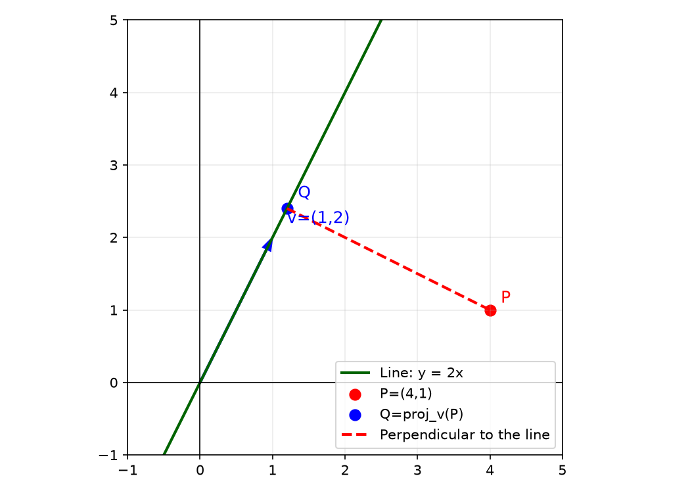

# Vectors

## Goal of the Set

After completing this set, the student should be comfortable performing vector operations in $\mathbb R^2$ and $\mathbb R^3$, understand length, angle, dot product, cross product, projection, and linear dependence. Vectors should be treated both computationally and geometrically.

Giving only the final result is not a complete solution. In every exercise, the student should show **which mechanism is being used**, and whenever possible, check the result or give it a geometric interpretation.

## Basic Exercises from mathematics

### Exercise 1. Vector Operations and Their Meaning
For $u=(2,-1,3)$ and $v=(-1,4,2)$ compute

$$
u+v,\qquad u-v,\qquad 3u-2v.
$$

Then verify that $(u+v)-v=u$, and explain geometrically what adding two vectors means.

> **Why this exercise:** reinforces basic operations and immediately connects them with their geometric meaning.

### Exercise 2. Distance as the Length of a Vector
The points are $A=(1,2,3)$ and $B=(4,-2,6)$.

1. Construct $\overrightarrow{AB}$.
2. Compute its length.
3. Compute the distance between the points using the coordinate formula.
4. Explain why both calculations give the same result.

> **Why this exercise:** shows that the point-distance formula comes directly from the length of a difference vector.

### Exercise 3. Vector Normalization
For $v=(3,4)$ find a unit vector $e$ with the same direction and orientation. Check that $\|e\|=1$, reconstruct $v$ in the form $v=\|v\|e$, and explain what changes during normalization and what remains unchanged.

> **Why this exercise:** teaches how to separate direction from vector length.

### Exercise 4. Dot Product and Perpendicularity
For $u=(1,2,-1)$ and $v=(2,-1,3)$ compute $u\cdot v$ and determine whether the vectors are perpendicular. Then find $a$ so that $w=(2,-1,a)$ is perpendicular to $u$, and check the result.

> **Why this exercise:** shows the dot product as both a test and a tool for constructing a perpendicularity condition.

### Exercise 5. Angle Between Vectors
Given $u=(1,1,0)$ and $v=(1,0,1)$:

1. Use the sign of $u\cdot v$ to predict the type of angle.
2. Compute the angle.
3. Compare the result with the prediction.

> **Why this exercise:** teaches how to extract qualitative information first and only then perform the exact calculation.

### Exercise 6. Projection and Perpendicular Component
Find the projection of $u=(4,2)$ onto the direction $v=(1,1)$. Then compute

$$
r=u-\mathrm{proj}_v\,u
$$

and verify that $r\cdot v=0$. Explain this result geometrically.

> **Why this exercise:** shows projection as a decomposition into parallel and perpendicular components.

### Exercise 7. Linear Dependence Without Heavy Computation
Given

$$
u=(1,2,3),\qquad v=(2,4,6),\qquad w=(0,1,1).
$$

Identify a specific relation between $u$ and $v$, decide whether the three vectors can be linearly independent, and explain why no long calculation is needed.

> **Why this exercise:** develops the habit of recognizing structure before applying a computational procedure.

### Exercise 8. Linear Combination and Checking the Result
Check whether $w=(5,1)$ can be written as

$$
w=au+bv,
$$

where $u=(1,1)$ and $v=(2,-1)$. If so, find $a,b$, reconstruct $w$ from them, and explain the geometric meaning of the existence of such coefficients.

> **Why this exercise:** connects linear combinations with the geometry of directions.

### Exercise 9. Cross Product as a Perpendicular Direction
For $u=(1,2,0)$ and $v=(0,1,3)$ compute $u\times v$. Use dot products to check perpendicularity to both vectors, compute $v\times u$, and compare the results.

> **Why this exercise:** teaches the geometric meaning of the cross product and the effect of changing the order of its arguments.

### Exercise 10. Triangle Area from Vectors
The points $A=(0,0,0)$, $B=(2,1,0)$, and $C=(1,3,2)$ form a triangle. Construct $\overrightarrow{AB}$ and $\overrightarrow{AC}$, compute the area of the parallelogram using the cross product, and then find the area of the triangle. Explain the factor $\frac12$.

> **Why this exercise:** shows the interpretation of the length of the cross product as area.

## More Challenging Exercises

### Exercise 11. Decomposition into Parallel and Perpendicular Components
Decompose $u=(3,4)$ into components parallel and perpendicular to $v=(1,2)$. Check

$$
u=u_{\parallel}+u_{\perp},\qquad u_{\perp}\cdot v=0.
$$

Explain why these are two independent checks of correctness.

> **Why this exercise:** deepens the idea of projection through construction and verification.

### Exercise 12. A Normal Vector to a Plane
Given $A=(1,0,2)$, $B=(2,1,0)$, and $C=(0,3,1)$. Construct two vectors lying in the plane, find a vector perpendicular to both, and check the perpendicularity using dot products.

> **Why this exercise:** creates a direct bridge from vectors to the description of a plane.

### Exercise 13. Do Four Points Lie in One Plane?
Given

$$
A=(0,0,0),\qquad B=(1,2,0),\qquad C=(0,1,1),\qquad D=(2,5,1).
$$

1. Construct $\overrightarrow{AB}$ and $\overrightarrow{AC}$.
2. Find $n=\overrightarrow{AB}\times\overrightarrow{AC}$.
3. Construct $\overrightarrow{AD}$ and check whether $\overrightarrow{AD}\cdot n=0$.
4. Based on this, decide whether $D$ lies in the plane determined by $A,B,C$, and justify the criterion.

> **Why this exercise:** combines the known cross and dot products into a geometric criterion needed for planes, without introducing a separate concept used only once.

### Exercise 14. Closest Point on a Line
Given a point $P=(4,1)$ and a line through the origin with direction $v=(1,2)$. Using projection, find the closest point on the line, the distance from $P$ to the line, and verify that the appropriate vector is perpendicular to the direction of the line.

A picture of the setup is shown below.

> **Why this exercise:** shows projection as a complete solution to a minimum-distance problem.

### Exercise 15. Comparing Directions Using the Cosine of the Angle
Given

$$
a=(1,2,1),\qquad b=(2,4,2),\qquad c=(2,0,3).
$$

For each pair, compute

$$
\frac{u\cdot v}{\|u\|\,\|v\|}.
$$

Order the pairs by increasing angle between the vectors. Explain why for $a$ and $b$ the value is $1$ even though the vectors have different lengths.

> **Why this exercise:** reinforces the connection between the dot product and angle, and the distinction between direction and length.
